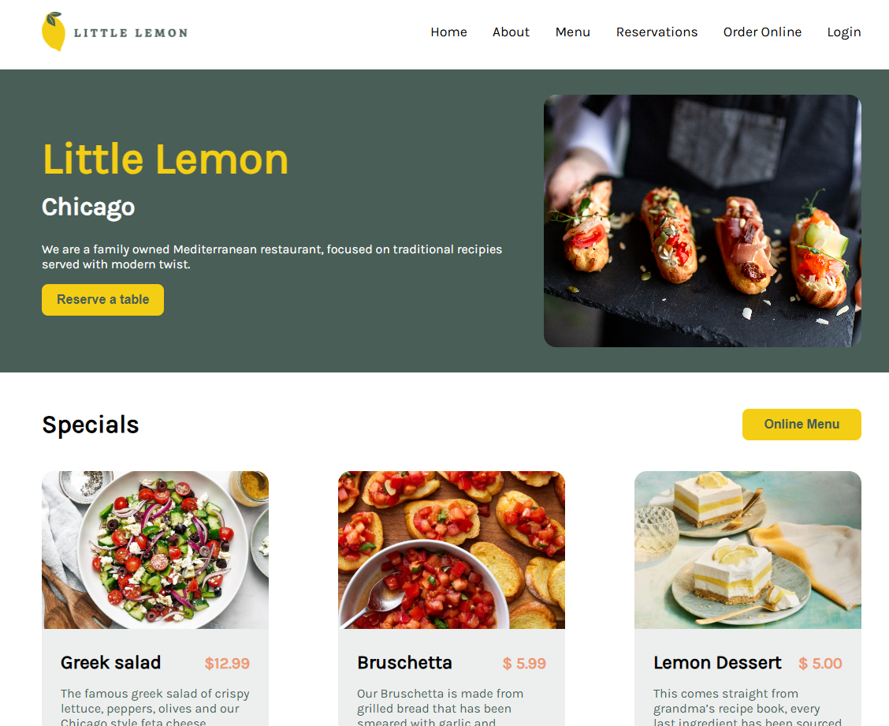

# Little Lemon Restaurant :lemon:

This is a React project created for the Meta Front-End Developer course. It is a webpage for the Little Lemon Restaurant with a online table reservation feature.

You can see a preview of the website here: 

## Live Preview

It is possible to test the live versione of the version via this link: [View Live Demo] (to be added)

## Available Scripts

In the project directory, you can run:

### `npm start`

Runs the app in development mode.\
Open [http://localhost:3000](http://localhost:3000) to view it in your browser.